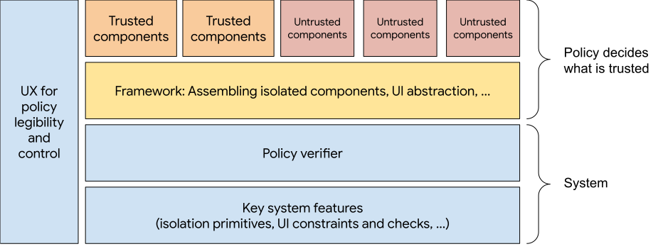

## Exploring Improvements to Fingerprinting Risk for Open Web APIs

Jan 20, 2022 - [wkorman@chromium.org](mailto:wkorman@chromium.org), representing discussions with the ArcsJs and Fugu teams, and a number of other Blink contributors.


## Problem Statement

There are a range of desirable open web APIs that introduce privacy concerns due to fingerprinting risk. Some of these are already shipped, while others are requested or in varying stages of development. There is a tension between providing user-requested powerful APIs and the risks they can present to the user.

Browsers can provide UI to allow users to select specific resources and therefore reduce the data that is made available to web applications via APIs. For example, for camera access, the API and browser UI allows the user to select a specific camera rather than providing an enumeration of all cameras, dramatically reducing the entropy shared with the web app. However, this can hamper the user experience of web applications in some cases. For example, in a full screen presentation scenario, integrating the target display selection into the web application UI can be a simpler experience than interacting with browser UI.

Therefore, we see value in exploring ways to allow web applications to provide developer-built user interfaces for selection among multiple options while minimizing data exposed or otherwise egressed to the containing web application.

The [Local Font Access API](https://chromestatus.com/feature/6234451761692672) is one specific, recent, and relevant API example use case to study. There is substantial developer interest in the functionality. Some developers requesting this API have explicitly stated that the browser provided picker does not work for their desired user flows. There are privacy concerns around shipping this API due to [fingerprinting risk](https://web.dev/local-fonts/#local-fonts-as-fingerprint-vector).


## A Possible Approach

The Arcs and [Fugu](https://www.chromium.org/teams/web-capabilities-fugu/) teams at Google are exploring a possible solution to this problem in the form of a lightweight, privacy-preserving JS-based framework called [ArcsJs](https://g3doc.corp.google.com/knowledge/cerebra/arcs/g3doc/webarcs/index.md?cl=head). Small components[^1] are written in JS with their data inputs and outputs explicitly specified. Components can be connected together in a graph with optional support for framework-controlled rendering via a virtual DOM and an abstract notion of rendering surfaces. Points of data egress are explicitly specified. Components are run in isolation. The Raksha [policy specification and enforcement system](https://github.com/google-research/raksha) can allow defining and validating constraints that should be present in the graph. All portions of this including the framework, policies, and components are intended to be open source for transparency, inspectability, and improvement.

Calling out further a point made above – a key aspect of the proposal is that web developers do not have direct access to the DOM when using functionality built with this framework. Instead, the framework manages both the components (which, VDOM-style, can output for rendering (a) model data, and (b) a template with a subset of html) and the rendering surfaces (e.g. iframes, windows, or even other devices, though that is outside the scope of this proposal). There is framework-managed support for components to bind to and interact with surface events. Events returned to isolated components only contain minimal information and do not reveal e.g. where on the screen the element was rendered. The goal is to approximate a "write-only" DOM, such that a component can at most (through events) read back information it originally submitted. This is to prevent a component from crossing the DOM or reading computed values, as these could allow indirectly communicating with other components.

For application to the Local Font Access API, the framework is intended to be treated by the browser as a “trusted” component. Browser engineers would write and code-review a small set of “trusted” JS components. Web developers would then write one or more JS components themselves, to provide for app-specific customization. This allows _structuring browser-provided API logic so as to minimize fingerprinting risk while still allowing for developer customization_.

A layer diagram could look something like:



 A policy specifies that the only data egressed is the single font picked by the user and that each font has to be independently scored or filtered. The component written by the web developer only sees one font at a time for purposes of ranking and rendering. The framework enforces the policy, thus preventing any accrual of font info while iterating across fonts. There is a facility for the developer to pass in app-provided font-specific metadata to allow for things like user-favorited fonts managed, persisted, contextually ranked, and so forth by the application. 

Although returning the single picked font in full to the web developer can still lead to fingerprinting, e.g. if the font is a known corporate-specific font, the intent is that the overall scope and volume of data exposure, and thus fingerprinting risk, is reduced.

We believe it is possible to extend this approach to similarly improve on fingerprinting risk for additional APIs. An example could include a developer-customizable, privacy-preserving photo picker that has access to images on the local file system, in the application-specific cloud/local photos, and other cloud based photo providers. Similar customizable pickers could be provided for things like camera, USB, and Bluetooth. For example, a camera flow could have customizable UI that allows the developer to apply their desired application-specific look and feel while choosing among devices and configuring camera options. Only the final image captured and chosen by the user would be returned to the web application. This could reduce work browser developers have to do today to carefully design and implement APIs to preserve privacy, e.g. using opaque device identifiers that are reset when cookies are cleared.

Considering the existing browser-provided UI picker patterns, they do work in reducing fingerprinting risk. It can therefore be tempting to just continue adding more API-specific browser UI pickers as needed, and consider alternate ways to allow styling. However, apart from the intrusive end-user workflow noted earlier, (a) this puts an ongoing development burden on the browser vendors, (b) the feedback loop with developers may be slow, and (c) the styling support may have limited flexibility.

The proposal here aims at a middle ground: developers would get a lot more flexibility. There will still be some styling and functionality constraints, but when encountered, they can work with browser vendors to add or improve trusted components to support their use case. These can be designed in a way that ideally serves many more developers for even more use cases. An explicit goal is to make that UI feel like a natural part of the application's UI, as opposed to system UI.

In a manner that is perhaps similar to the way that Houdini allows browser vendors to put more power directly into the hands of web developers to customize things like component layout and paint, this proposal could do the same for pickers and other APIs at risk of fingerprinting concerns. This would be achieved via, essentially, a browser-hosted policy-preserving managed component graph, with hooks allowing for developer customization.


### Conceptual Sketch

One can start by thinking of the proposal as if the font API provided an opaque handle to a list of fonts, which can then be fed into a framework that renders a custom picker without leaking the underlying handle data. There is some precedent for this in Web APIs – see for example [opaque filtered responses](https://fetch.spec.whatwg.org/#concept-filtered-response) used with `fetch`.  Another analogy might be to an image you can display to the user without being able to access the pixels – see for example the notes on [security and tainted canvases](https://developer.mozilla.org/en-US/docs/Web/HTML/CORS_enabled_image#security_and_tainted_canvases). There are limited operations you can perform on a tainted image (e.g. rendering it into a canvas, compositing on top of it – which is in fact a very constrained read-write operation). [AudioWorklets](https://developer.mozilla.org/en-US/docs/Web/API/AudioWorklet) could be seen as another example, as they provide access to intermediate values in an audio processing pipeline while only having the ability to pass computations based on those values to the next stage in the pipeline.

These existing web primitives restrict what can be done by the application developer without eliminating the ability to act based on the content.

A developer using the font API could write code that issues `navigator.fonts.query()`, which returns an opaque handle, which it passes to the browser-hosted framework-powered picker.

The policy outlined above is attached to the opaque handle. The picker is allowed to see the data as long as it is compliant with the policy, and if so it returns a single font (no longer opaque) from that list.


```
// The image below can be displayed, but not probed. 
const image = fetch(...unsafe domain...);
// The font list below can be used in pickers, but not probed.
const fonts = navigator.fonts.query();
```


The first few steps described can be further moved to become browser/framework-internal implementation details, simplifying the developer experience to something more like:


```
const pickedFont = navigator.fonts.pick(
    <custom JS component url>, <app font metadata>);
```


There are additional considerations per developer feature requests, e.g. to allow integrating an optional provided list of web fonts, and more flexible custom layout perhaps requiring multiple components, but this is the gist of things.


### Conscious Tradeoffs

The above thinking could seem like a lot from a web-developer-facing API surface perspective. However, the actual exposed API surface can be minimal and aim to fit reasonably with modern web APIs, e.g., it could look something like `navigator.fonts.pick('kind', 'optional-app-data')`. The new technical aspects include (a) components using a constrained templating language of some form for rendering, and (b) the developer having to understand the method interface available to a component, so as to be able to write any custom component(s) they may need.

That said, it is unavoidably a different, more restrictive style of development required to write these privacy-preserving components versus a standard web page or web component. Note that these components typically represent smaller pieces of logic, and the specific template engine can be pluggable. There is some precedent for similar pieces of logic in Worklets and Workers, discussed further below.


## Community Engagement and Experimentation

In the spirit of the [Extensible Web Manifesto](https://github.com/extensibleweb/manifesto), we would like to engage with the open web community via WICG or similar to consider this approach to address the fingerprinting problem generally, with the Local Font Access API as a specific example, and with others following a similar opaque handle with attached policy pattern. The intent is to explore both the approach described above along with any others raised by the community.

In parallel, we are interested in exploring whether/when there is a suitable method to experiment with this approach in Chromium/Blink via flag, origin trial, or similar. Though we can experiment in the open without this, a key value proposition of the proposal is the framework itself being “trusted”, allowing the browser to relax the requirement for a user-facing system picker permission prompt UI gating local font data access. Achieving this requires some form of browser integration beyond what is exposed via open web APIs today. The closest we believe we can get in the open today is to ask both developers and end-users to enable the existing Local Font Access API flags in specific Chrome versions and accept the one-time domain-specific permission prompt. We have [a demo of this approach](https://glitch.com/edit/#!/arcs-font-playground), including [a sample component](https://glitch.com/edit/#!/arcs-font-playground?path=Library%2FLocalFonts.js%3A1%3A0) the developer would write.


## Further Considerations


### Isolation

The specifics of how component isolation is achieved are flexible and open to discussion and evolution. Our approach requires making many small isolation containers, e.g. one per font when invoking the ranking function.

We’ve experimented with both web workers and [SES](https://github.com/endojs/endo/tree/master/packages/ses)[^2]. Related efforts include [Fenced Frames](https://chromestatus.com/feature/5699388062040064) and [Shadow Realms](https://github.com/tc39/proposal-shadowrealm). We intend to explore these further with the involved communities. We’re aware that best practices to mitigate side channel attacks frequently default to full process isolation. ArcsJs can use isolation in such a manner, should it be determined to be a requirement. It is understood that full process isolation can be a prohibitive cost for some use cases and platforms, e.g. due to latency or system resource overhead.

We have explored the use of WebAssembly for finer-grained lighter weight isolation. While this is beyond the scope of what is considered in this proposal, in addition to the obvious benefit of multi-language component support, Wasm may have the potential to enable use cases that have more components, lower latency needs, and so forth in the future.

Beyond ensuring isolation of components, we have to consider covert channels between the hosting webpage and colluding untrusted components. We have work underway to explore such covert channel attacks and mitigations in the open with a research-oriented test bed, to inform our isolation approaches and to better understand risk levels and tradeoffs.


### Standards

Looking ahead, if the ArcsJs-based proposal (or something similar) turns out to make sense, it could benefit from multiple specifications. Examples of things one might want to make pluggable include (a) isolation primitives, (b) restricting DOM reads (to replace the VDOM-style template rendering), (c) policy enforcement, and (d) the privacy-preserving framework itself.

There are a number of existing and proposed relevant technologies and specifications. We mentioned Fenced Frames and Shadow Realms previously in the context of isolation. Web Components, perhaps with some modifications, could be relevant for constraining DOM access. Intersection Observer could be relevant to ensure rendered UI visibility.

There are some similarities with what is being considered here to [Houdini](https://developer.mozilla.org/en-US/docs/Web/Guide/Houdini), e.g. the JS components could potentially be a type of Worklet.

There is exploratory work aimed at mitigating fingerprinting risk as part of the [Privacy Sandbox](https://privacysandbox.com/) and [Privacy Budget](https://github.com/bslassey/privacy-budget) efforts.

Above are just early thoughts. Work here should be driven by concrete requirements and further detailed consideration with involved parties.


### Other Prior Efforts

We recognize that Blink, and the open web platform more generally, prefers not to ship “opinionated libraries” or frameworks. Rather, there is a focus on identifying the most minimal set of primitives necessary to allow for the desired new functionality. We are both not yet sure of the overall approach “fit” or shape, and we are accordingly not yet sure what new primitives may be necessary. Further exploration feels important and can be done in the open, in JS, with caveats and questions as noted in the Experimentation section above.

Other prior efforts that could inform thinking on this proposal include [Blink-in-JS](https://www.chromium.org/blink/blink-in-js) and [Layered APIs](https://groups.google.com/a/chromium.org/g/blink-dev/c/MFbJuzA5tH4/m/t6Q-LZHpAgAJ) in that, while the framework we propose is intended to be as small in scope and lightweight as possible, it is still a framework with several subsystems/layers. This feels less commonly seen in web functionality, specifications, and standards discussions. While what we consider here is focused initially around a narrow use case in the Local Font Access API, we are exploring it due to the broader relevance, value, and potential for positive impact on a much wider range of use cases.

Though the proposal is currently implemented in JS, as new browser primitives are identified, those could be crystallized through discussion and considered for implementation in native code as appropriate.


<!-- Footnotes themselves at the bottom. -->
## Notes

[^1]:
     We use the word “component” in the general software engineering sense. In ArcsJs we currently call them “particles”. Note that these components can involve data processing without any UI or rendering.

[^2]:
     The use of workers and SES for isolation is itself exploratory and we are aware of key limitations. Our intent is to work with the Fugu and security teams to determine the appropriate manner of isolation for specific early use cases such as the Font Access API, as well as what might be envisioned for more complex or riskier potential use cases ahead.
